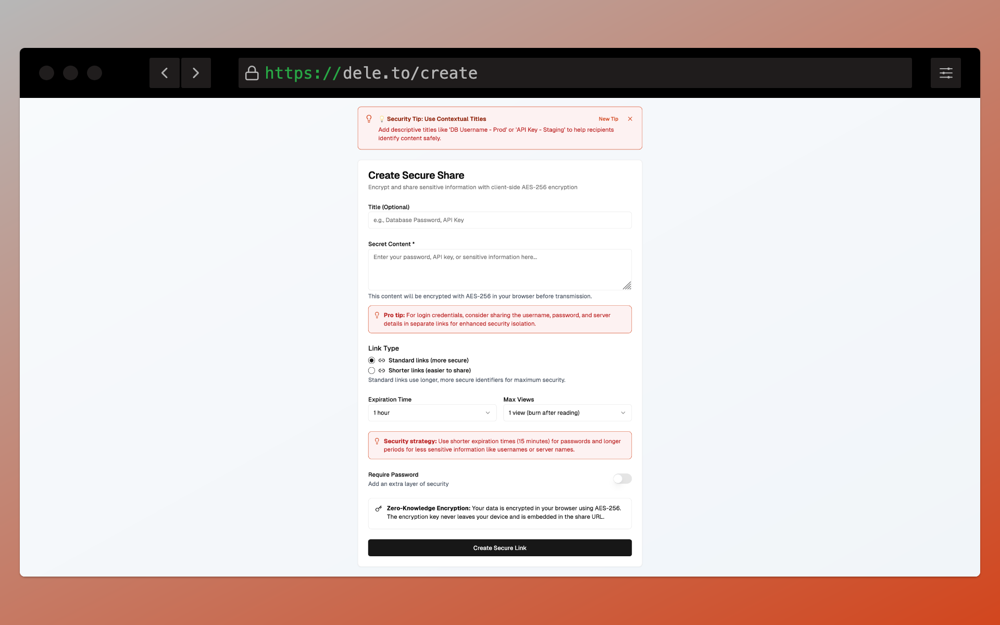
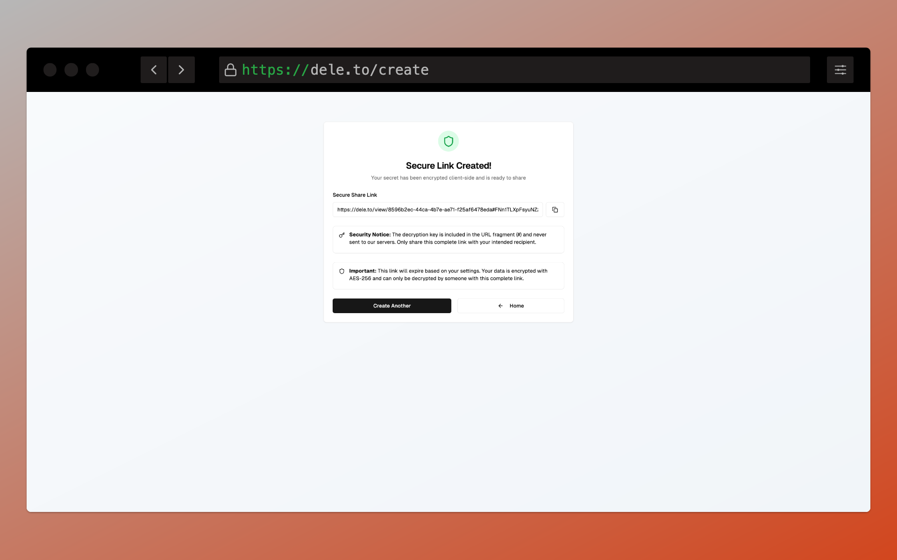
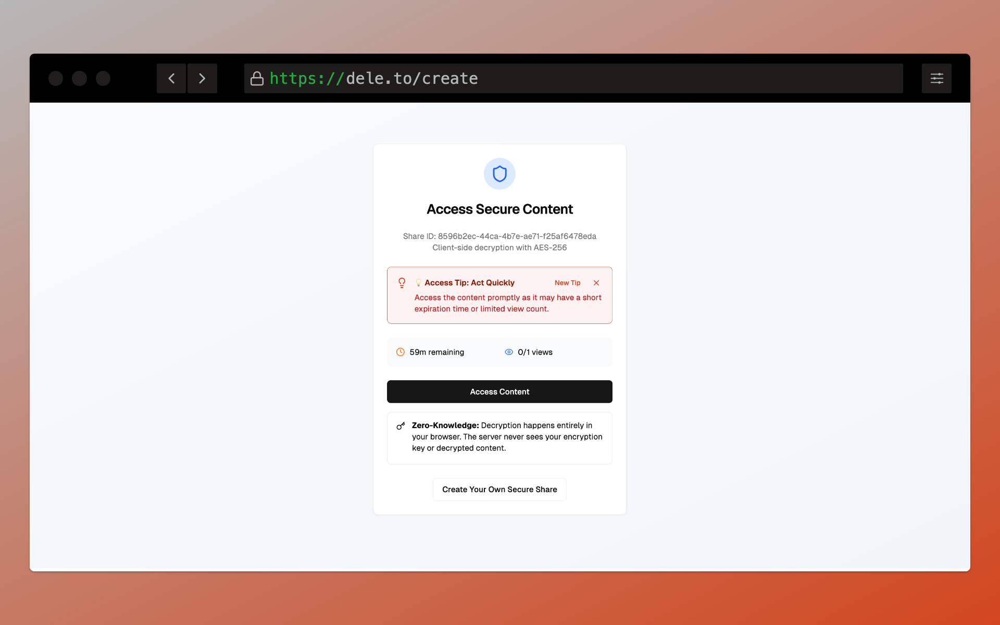
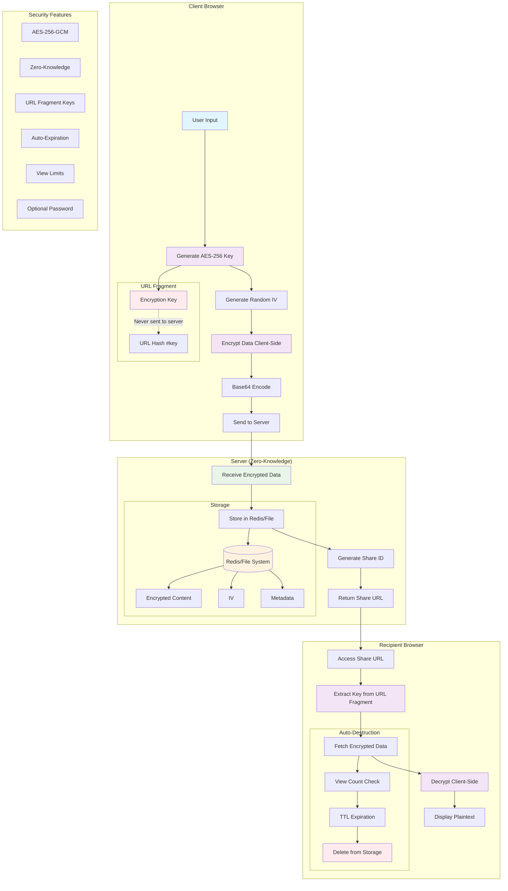

# DELE.TO 🔥 [![License: MIT][license-badge]][license] [![Buy me a Coffee][buy-me-a-coffee-badge]][buy-me-a-coffee]
<a href="https://www.producthunt.com/products/deleto?embed=true&utm_source=badge-featured&utm_medium=badge&utm_source=badge-deleto" target="_blank"></a>

[license]: https://opensource.org/licenses/MIT
[license-badge]: https://img.shields.io/badge/License-MIT-blue.svg
[buy-me-a-coffee-badge]: https://img.shields.io/badge/Buy_Me_A_Coffee-FFDD00?style=flat&logo=buy-me-a-coffee&logoColor=black
[buy-me-a-coffee]: https://www.buymeacoffee.com/arddluma

*From Latin dēlētō — "erase, destroy."*

**Secure credential sharing with client-side AES-256 encryption, zero-knowledge architecture, and automatic self-destruction.
Alternative to PasswordPusher, Yopass and Bitwarden Send**

DELE.TO is a modern, secure platform for sharing sensitive information like passwords, API keys, and credentials. Built with Next.js 14 and featuring client-side encryption, your data is encrypted in your browser before it ever reaches server.

🔗 https://dele.to — Try it instantly in your browser. No signup required.

## 📋 Table of Contents

- [✨ Features](#-features)
- [📸 Screenshots](#-screenshots)
- [🚀 Quick Start](#-quick-start)
- [🏗️ Architecture Overview](#️-architecture-overview)
- [🔐 Encryption & Decryption Process](#-encryption--decryption-process)
- [🔄 Data Flow Example](#data-flow-example)
- [🧪 Testing](#-testing)
- [🛠️ Tech Stack](#️-tech-stack)
- [📁 Project Structure](#-project-structure)
- [🧰 Development Tips](#-development-tips)
- [🤝 Contributing](#-contributing)

## ✨ Features

- 🔐 **Client-side AES-256-GCM encryption** - Data encrypted in your browser
- 🔑 **Zero-knowledge architecture** - Server never sees your encryption keys
- ⏰ **Auto-expiration** - Set custom expiration times (15m to 7 days)
- 👁️ **View limits** - Burn-after-reading with configurable view counts
- 🔒 **Optional password protection** - Add extra security layer
- 🌐 **URL fragment keys** - Encryption keys never sent to server
- 💾 **Redis storage** - Encrypted data with automatic TTL cleanup
- 📱 **Responsive design** - Works on all devices

## 📸 Screenshots

<div style="display: flex; overflow-x: auto; white-space: nowrap; padding-bottom: 20px;">
  
  
  
</div>


## 🚀 Quick Start

### Prerequisites

- **Node.js 20+** - [Download here](https://nodejs.org/)
- **pnpm** (recommended) - Install with `npm install -g pnpm`
- **Git** - For cloning the repository

**Optional for Production:**
- **Redis** - For production scaling (uses local file storage by default)

### Step-by-Step Setup

#### 1. Clone and Navigate
```bash
git clone https://github.com/dele-to/dele-to.git
cd dele-to
```

#### 2. Install Dependencies
```bash
# Using pnpm (recommended)
pnpm install

# Or using npm
npm install

# Or using yarn
yarn install
```

#### 3. Environment Configuration (Optional for Development)

**For Development:** No configuration needed! The app works out of the box using local file storage.

**For Production:** 


[](https://vercel.com/new/clone?repository-url=https%3A%2F%2Fgithub.com%2Fdele-to%2Fdele-to)

Create your environment file for Redis storage:
```bash
cp .env.example .env
```

Edit `.env` with your configuration:
```env
# Redis Configuration (Required for production)
KV_REST_API_URL=your_redis_url_here
KV_REST_API_TOKEN=your_redis_token_here

# Security Salt (Change this in production!)
SALT=your-super-secret-salt-change-me-in-production

```

> **💡 Development Note:** The app automatically uses local file storage (`./secure-shares/` directory) when Redis is not configured, making it perfect for development and testing without any setup.

#### 4. Start Development Server
```bash
pnpm dev
```

The app will be available at **http://localhost:3000**

#### 5. Test the Application
1. Open http://localhost:3000 in your browser
2. Click "Share Securely" to create a test share
3. Enter some test data and create a share
4. Copy the generated link and test viewing it

### Running with Docker

#### Manual Setup (without Redis - local file storage)

```bash
docker build -t dele-to .
## This persists the shares data to your host machine (as Redis is not used)
docker run -p 3000:3000 -v "$(pwd)/.secure-shares:/app/.secure-shares" --name dele-to dele-to
```
#### To run with Redis (recommended for production):

```bash
docker compose up --build -d
```

The application will be available at **http://localhost:3000**.

## 🏗️ Architecture Overview

<details>
<summary><strong>🏗️ Architecture Overview</strong> (Click to expand)</summary>

DELE.TO uses a zero-knowledge architecture where encryption happens entirely client-side:

<details>
<summary><strong>📊 System Architecture Diagram</strong> (Click to expand)</summary>



</details>


</details>

## 🔐 Encryption & Decryption Process

<details>
<summary><strong>🔐 Encryption & Decryption Process</strong> (Click to expand)</summary>

### 1) Key & IV Generation (Client-Side)
```js
// AES-256 key
const key = await crypto.subtle.generateKey({ name: "AES-GCM", length: 256 }, true, ["encrypt", "decrypt"]) 
// 96-bit IV (12 bytes)
const iv = crypto.getRandomValues(new Uint8Array(12))
```
- Keys never leave the browser. Fresh IV per encryption. IV is not secret.

### 2) Encrypt
```js
const encoder = new TextEncoder()
const encrypted = await crypto.subtle.encrypt({ name: "AES-GCM", iv }, key, encoder.encode(plaintext))
```
- AES-256-GCM provides confidentiality + authentication (integrity).

### 3) Encode for Transport
```js
const encryptedContent = btoa(String.fromCharCode(...new Uint8Array(encrypted)))
const ivString = btoa(String.fromCharCode(...iv))
```
- Base64 makes binary safe for JSON/HTTP.

### 4) Decrypt (Recipient Browser)
```js
// fragment contains the raw key material exported earlier (never sent to server)
const keyBytes = /* decode from fragment */
const importedKey = await crypto.subtle.importKey("raw", keyBytes, { name: "AES-GCM" }, true, ["decrypt"]) 

// iv and encryptedContent come from server response
const decrypted = await crypto.subtle.decrypt({ name: "AES-GCM", iv }, importedKey, encryptedBytes)
const plaintext = new TextDecoder().decode(decrypted)
```

### Notes on encryptedContent and iv
- `encryptedContent`: Base64 ciphertext, meaningless without the key.
- `iv`: Base64 12-byte IV. Required for decryption; safe to store alongside ciphertext.

</details>

## Data Flow Example

<details>
<summary><strong>Data Flow Example</strong> (Click to expand)</summary>
Let's trace what happens when you encrypt "my secret password":

**Input:** `"my secret password"`

**Step 1: Key Generation**
```
🔑 AES-256 Key: [32 random bytes] 
   Example: 4a7d1ed414474e4033ac29ccb8653d9b...
```

**Step 2: IV Generation**
```
🎲 IV (12 bytes): [random bytes]
   Example: nb4WF+rLL5dokQnO (base64)
```

**Step 3: Encryption**
```
📝 Plaintext: "my secret password"
🔒 AES-256-GCM Encryption
📦 Ciphertext: [encrypted bytes]
   Example: uJN+TP0nsj2oFPRQOS7+tJIwZko= (base64)
```

**Step 4: What Gets Sent to Server**
```json
{
  "encryptedContent": "uJN+TP0nsj2oFPRQOS7+tJIwZko=",
  "iv": "nb4WF+rLL5dokQnO",
  "title": "",
  "expirationTime": "1h",
  "maxViews": 1,
  "requirePassword": false,
  "linkType": "standard"
}
```

**Step 5: Share URL Creation**
```
🔗 URL: https://dele.to/view/abc123#[base64-encoded-key]
                                      ↑
                              This key NEVER goes to server
```
 </details>


## 🧪 Testing


```bash
# Run all tests
pnpm test

# Generate coverage report
pnpm test:coverage

# Test specific encryption functions
pnpm test -- --testPathPattern=crypto.test.ts
```

**📊 For detailed test status and coverage reports, see [TEST_STATUS.md](TEST_STATUS.md)**

### Storage Options

#### File Storage (Development Default)
- **✅ No setup required** - works out of the box
- **📁 Location**: `./secure-shares/` directory (auto-created)
- **🎯 Perfect for**: Development, testing, and local demos
- **⚠️ Limitations**: Not suitable for production scaling or multiple servers

#### Redis Storage (Production Recommended)
- **🔧 Setup**: Add Redis URL and token to `.env` or Vercel environment variables
- **☁️ Provider**: [Upstash](https://upstash.com/) (free tier available)
- **🚀 Benefits**: Automatic TTL, better performance, horizontally scalable

### 🧰 Development Tips

<details>
<summary><strong>🧰 Development Tips</strong> (Click to expand)</summary>

1. **Hot Reload**: Changes to code automatically refresh the browser
2. **TypeScript**: Full TypeScript support with type checking
3. **Tailwind**: Use Tailwind classes for styling
4. **Components**: UI components are in `components/ui/`
5. **Crypto**: Encryption logic is in `lib/crypto.ts`

---

#### Troubleshooting

• Module Not Found Errors
```bash
# Clear node_modules and reinstall
rm -rf node_modules package-lock.json
pnpm install
```

• Build Errors
```bash
# Clear Next.js cache
rm -rf .next
pnpm build
```

</details>

## 🛠️ Tech Stack

- **Framework**: Next.js 14 (App Router)
- **Language**: TypeScript
- **Styling**: Tailwind CSS
- **UI Components**: Radix UI + shadcn/ui
- **Database**: Redis (Upstash) with file system fallback
- **Encryption**: Web Crypto API (AES-256-GCM)
- **Icons**: Lucide React
- **Fonts**: Geist Sans & Geist Mono

## 📁 Project Structure

<details>
<summary><strong>📁 Project Structure</strong> (Click to expand)</summary>

```
secure-share-v2/
├── __tests__/                 # Jest tests
│   ├── crypto.test.ts
│   └── share-simple.test.ts
├── app/                       # Next.js app directory
│   ├── about/
│   ├── actions/
│   ├── alternatives/
│   ├── create/
│   ├── frame/
│   ├── miniapp/
│   ├── view/[id]/
│   ├── vs/
│   ├── globals.css
│   ├── layout.tsx
│   ├── not-found.tsx
│   └── page.tsx
├── components/                # React components
│   ├── ui/                    # shadcn/ui components
│   ├── access-tips.tsx
│   ├── console-message.tsx
│   ├── farcaster-debug.tsx
│   ├── farcaster-provider.tsx
│   ├── farcaster-ready.tsx
│   ├── footer.tsx
│   ├── inline-tip.tsx
│   ├── password-input.tsx
│   ├── security-tips.tsx
│   └── theme-provider.tsx
├── hooks/
│   ├── use-farcaster.ts
│   ├── use-mobile.tsx
│   └── use-toast.ts
├── lib/                       # Utility libraries
│   ├── crypto.ts              # Encryption utilities
│   ├── farcaster.ts
│   └── utils.ts
├── public/                    # Static assets
│   ├── .well-known/
│   │   └── farcaster.json
│   ├── favicon.ico
│   ├── favicon.png
│   └── SEO.png
├── styles/
│   └── globals.css
├── README.md
├── package.json
└── tailwind.config.ts
```

</details>

<!-- Removed trailing Security Features section (duplicate content) -->

## 🤝 Contributing

We welcome contributions! Here's how to get started:

### Development Setup

1. **Fork the repository** on GitHub
2. **Clone your fork** locally
3. **Create a feature branch**
   ```bash
   git checkout -b feature/amazing-feature
   ```
4. **Make your changes** and test thoroughly
5. **Commit with conventional commits**
   ```bash
   git commit -m "feat: add amazing feature"
   ```
6. **Push to your fork**
   ```bash
   git push origin feature/amazing-feature
   ```
7. **Open a Pull Request**


## 📄 License

This project is licensed under the MIT License - see the [LICENSE](LICENSE) file for details.

## 🙏 Acknowledgments

- [Next.js](https://nextjs.org/) - The React framework
- [Tailwind CSS](https://tailwindcss.com/) - Utility-first CSS
- [Radix UI](https://www.radix-ui.com/) - Accessible components
- [Lucide](https://lucide.dev/) - Beautiful icons
- [Upstash](https://upstash.com/) - Serverless Redis

## 📞 Support

- 📧 **Email**: support@dele.to
- 🐛 **Issues**: [GitHub Issues](https://github.com/dele-to/dele-to/issues)
- 💬 **Discussions**: [GitHub Discussions](https://github.com/dele-to/dele-to/discussions)

---
